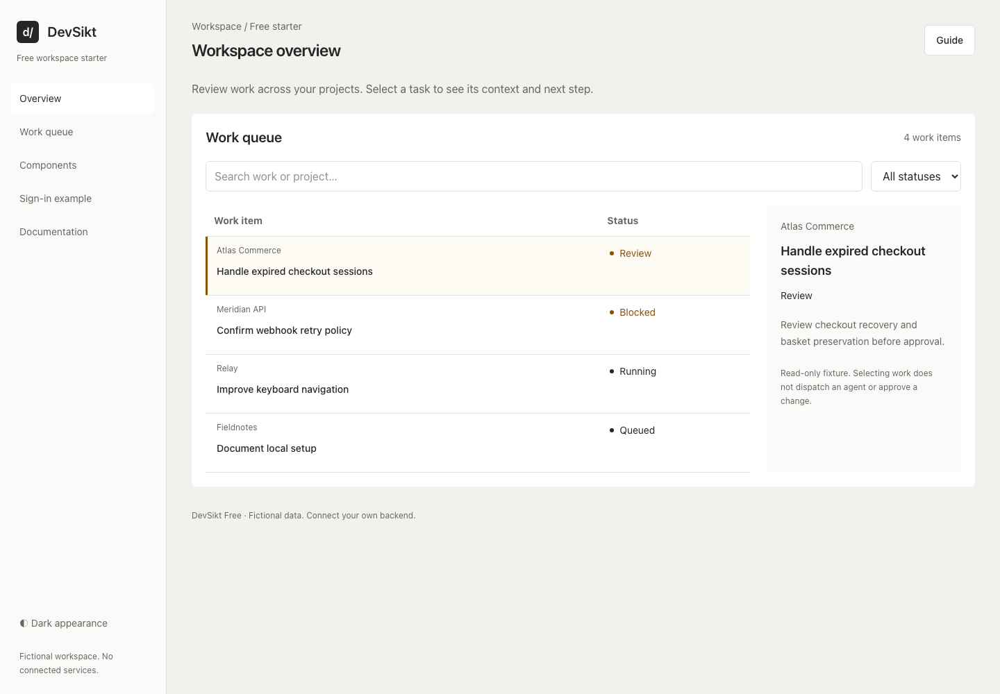

# DevSikt Free

An HTML-first Tailwind UI starter for developer workspaces. Customize it by hand or with a coding agent—without adopting a frontend application framework.

*Actual development preview, using fictional data. Final release contents may change.*

## A focused starting point

- Workspace overview and work queue, with search, status filtering and a selected-item inspector.
- Sign-in UI specimen, with validation and an explicit local-only completion state.
- Component sampler: buttons, loading feedback, fields, a confirmation dialog and copyable markup.
- Local getting-started guide and edition-specific `AGENTS.md` instructions.
- Shared design tokens, light/dark appearances and responsive layouts.

Built with HTML, Tailwind CSS 4, vanilla TypeScript and Vite. The starter is developed with keyboard, automated accessibility and responsive checks at mobile, tablet and desktop sizes. These checks are not a claim of accessibility certification.

## Free and Pro

Free is the smaller workspace starter. Pro is being prepared with additional work/run/review flows, chat variations, account and team screens, billing/support specimens and a broader component catalog.

Both are frontend UI themes. Neither provides real authentication, AI models, GitHub/Jira connections, billing or a backend.

## Release in preparation

This repository currently contains product information and a screenshot only. Source code, installation instructions, download archives, licence terms and hosted documentation will be added when approved. There is no published package to install yet.

Watch this repository for release updates. Public visibility does not grant permission to redistribute the preview image or imply a software licence. Pricing, support terms and release dates have not been announced.
